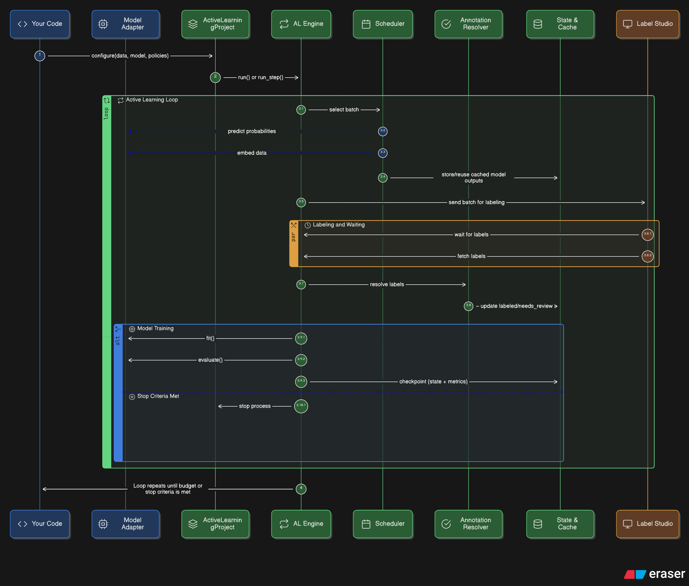

# Active Learning SDK 🧠

[](https://pypi.org/project/active-learning-sdk/)
[](https://www.apache.org/licenses/LICENSE-2.0)
[](https://www.python.org/downloads/)

[English](#english) | [Русский](#русский)

**Active Learning SDK** is a low-boilerplate, stateful Python orchestrator for text classification. It glues together your ML models, smart sampling algorithms (Uncertainty out of the box; extensible for Diversity/Bandits), and human-in-the-loop annotation interfaces (like **Label Studio**).

Stop writing fragile plumbing code to move JSONs back and forth. Plug in your dataset, pass your model, choose a sampling configuration, and let the SDK decide what a human should label next to maximize model quality under a fixed annotation budget.

---

<a id="english"></a>

## ⚡ Quickstart

The SDK handles the entire Active Learning loop: selecting informative samples, pushing them to Label Studio, waiting for human annotation, pulling the results, resolving labels via a policy, and retraining the model — all while saving crash-safe state and avoiding duplicate labeling tasks.

```python
import pandas as pd
from active_learning_sdk import (
    ActiveLearningProject,
    AnnotationPolicy,
    CacheConfig,
    FingerprintConfig,
    LabelBackendConfig,
    LabelSchema,
    PrelabelConfig,
    SchedulerConfig,
)
from active_learning_sdk.adapters import HFSequenceClassifierAdapter

# 1) Initialize a stateful project (crash-safe; resumable; idempotent rounds)
project = ActiveLearningProject("sentiment_analysis", workdir="./runs/sentiment")

# 2) Configure the pipeline
project.configure(
    dataset=pd.read_csv("unlabeled_data.csv"),  # expects 'sample_id' and 'text' columns
    label_schema=LabelSchema(task="text_classification", labels=["positive", "negative"]),

    # Wrap your custom model (e.g., HuggingFace, Scikit-Learn)
    model=HFSequenceClassifierAdapter(model=my_model, tokenizer=my_tokenizer),

    # Choose how to select the next samples (Entropy, Margin, Least Confidence, Random)
    scheduler_config=SchedulerConfig(mode="single", strategy="entropy"),

    # Connect to your annotation UI
    label_backend_config=LabelBackendConfig(
        backend="label_studio",
        mode="external",
        url="http://localhost:8080",
        api_token="YOUR_LABEL_STUDIO_TOKEN",
        # optionally: project_id=12,
    ),

    # Multi-annotator resolution & "don't wait forever" guarantees
    annotation_policy=AnnotationPolicy(
        mode="latest",              # MVP default (majority/consensus planned)
        min_votes=1,
        timeout_seconds=86400,      # 24h
        on_timeout="needs_review",  # or "accept_latest" / "raise" (implementation-defined)
    ),

    # Data integrity (prevents accidental dataset swap between runs)
    fingerprint_config=FingerprintConfig(mode="fast"),  # "strict" planned / optional

    # Cache predictions to save compute (and embeddings if supported later)
    cache_config=CacheConfig(enable=True, persist=True),

    # Optional: push model suggestions into Label Studio tasks (prelabeling)
    prelabel_config=PrelabelConfig(enable=True),
)

# 3) Run the loop (blocks until the requested batch is labeled, then retrains)
project.run(budget=1000, batch_size=50)

# 4) Generate a metrics report
project.generate_report("report.html")  # saved under workdir

> Non-blocking integration is supported via `project.run_step()` (intended for notebooks/services) so you can drive the state machine step-by-step.

---

## 🚀 Installation

Install the core SDK via pip:

```bash
pip install active-learning-sdk
```

Depending on your stack, install optional extras:

```bash
# For Label Studio integration
pip install "active-learning-sdk[labelstudio]"

# For HuggingFace Transformers support
pip install "active-learning-sdk[transformers]"
```

---

## 🛠 Features (v0.1.0)

* **Text-First Design:** Optimized for NLP tasks (single-label classification in MVP; multi-label via config is supported as a mode).
* **Stateful & Crash-Resistant:** Safe to interrupt at any time. Resuming won't create duplicate tasks in the labeling backend.
* **Bring Your Own Model:** Capability-based interfaces. If your model has `predict_proba()` + `fit()` + `evaluate()`, it works. Built-in adapters planned for Transformers and Scikit-Learn.
* **Smart Selection Strategies (MVP):** Uncertainty sampling (Entropy, Margin, Least Confidence) and Random selection out of the box.
* **Data Integrity:** Dataset fingerprinting prevents accidental dataset swap/edits between runs.
* **Performance:** Prediction caching prevents redundant computation across AL rounds (embeddings caching is supported when the model adapter provides embeddings).

---

## 🧩 How it works (in one page)

A project is a directory containing:

* **state** (versioned JSON, atomic writes),
* **round history** (selected sample IDs, created task IDs, statuses),
* **caches** (predictions/embeddings keyed by model version),
* **configuration** (backend, schema, policies, scheduler).

A single Active Learning round follows:

`Select → Push → Wait → Pull → Resolve Labels → Train/Evaluate → Checkpoint`

Key guarantees:

* **Idempotent rounds:** if the process crashes after pushing tasks, on resume it continues from the correct step and will not create duplicates.
* **Dataset fingerprint:** on resume the SDK validates the dataset fingerprint before doing anything else; mismatch raises an error (no silent mixing of data).
* **Policy-driven label resolution:** multi-annotator outputs are resolved by `annotation_policy`. In MVP, the default is `mode="latest"` to avoid complex deadlocks.

---

## 🏗 Label Studio Setup

The recommended way to use the SDK is to connect it to an externally running Label Studio instance.

Quick start with Docker (detached):

```bash
docker run -d --name label-studio \
  -p 8080:8080 \
  -v "$(pwd)/label_studio_data:/label-studio/data" \
  heartexlabs/label-studio:latest
```

Open `http://localhost:8080`, create an account, go to **Account & Settings**, and copy your **Access Token** to use as `api_token`.

> Tip: on Windows PowerShell, replace `"$(pwd)/label_studio_data:..."` with an absolute path.

---

## 🧠 Architecture




The SDK is an orchestrator with strict separation of concerns:

* Project state & idempotency (core engine)
* Selection strategies (scheduler)
* Labeling backend (Label Studio interface)
* Model adapter (capability-based)

The standard round is:

`Select Samples (Model + Strategy) → Push Tasks (Backend API) → Wait (Human) → Pull Annotations (Backend API) → Resolve Labels (Policy) → Train & Evaluate (Model) → Checkpoint State`

### Code map (where to look)

* `src/active_learning_sdk/project.py` — user-facing facade (`ActiveLearningProject`)
* `src/active_learning_sdk/engine.py` — state machine, selection context, scheduler glue
* `src/active_learning_sdk/configs.py` — config dataclasses
* `src/active_learning_sdk/types.py` — enums and core data structures
* `src/active_learning_sdk/state/` — state store + locking
* `src/active_learning_sdk/dataset/` — providers + fingerprinting
* `src/active_learning_sdk/strategies/` — built-in strategies
* `src/active_learning_sdk/backends/` — labeling backends (Label Studio scaffold)
* `src/active_learning_sdk/adapters/` — model adapter protocols/implementations
* `src/active_learning_sdk/cache.py` / `src/active_learning_sdk/annotation.py` — cache + annotation aggregation

### Optional: PlantUML source (for `docs/architecture.puml`)


---

## 🔧 Troubleshooting (common issues)

* **`DatasetMismatchError` on resume:** the dataset changed (IDs, schema, content, or file). Restore the original dataset or start a new project directory.
* **Duplicate tasks appear in Label Studio:** ensure you always resume using the same `workdir` and do not delete state files mid-run. Idempotency relies on stored task mappings.
* **Label Studio unreachable / auth fails:** verify `url` and `api_token`. Confirm the token is from **Account & Settings**.
* **Run blocks forever:** check `annotation_policy.timeout_seconds` and `on_timeout`. In MVP the recommended default is to move unresolved items into `needs_review`.
* **Slow selection rounds:** enable caching and ensure your model adapter provides a stable `get_model_id()` (when available) so caches can invalidate correctly.

---

## 🗺 Roadmap (high-level)

* **v0.1.0**: text MVP + Label Studio external backend + idempotent rounds + dataset fingerprint + uncertainty strategies + caching + basic report
* **v0.2.0**: majority/consensus policies + `needs_review` workflow improvements + embeddings-based strategies (diversity)
* **v0.3.0**: bandit scheduler + reward normalization + richer analytics
* **v0.4.0+**: multi-modal data, RAG workflows, LLM labeling backends, plugin hooks, custom selectors

---

## 🤝 Contributing & License

This project is licensed under the **Apache License 2.0**. See `LICENSE`.

Pull requests are welcome. Please include tests for:

* crash-after-push resume (no duplicate tasks),
* dataset fingerprint mismatch behavior,
* round state transitions and idempotency.

---

---

<a id="русский"></a>

# Active Learning SDK 🧠

**Active Learning SDK** — это Python-библиотека-оркестратор для автоматизации цикла активного обучения (Active Learning) в задачах классификации текста. Она берет на себя всю грязную работу по интеграции ML-моделей, умного выбора данных (Uncertainty — в MVP; расширяемо до Diversity/Bandits), и интерфейсов разметки (например, **Label Studio**).

Хватит писать хрупкие скрипты для перекладывания JSON-ов. Подключите датасет, передайте модель, выберите конфигурацию выборки — и SDK сам решит, какие тексты нужно дать человеку на разметку, чтобы улучшать качество модели максимально эффективно при ограниченном бюджете.

## ⚡ Быстрый старт

SDK управляет циклом: выбирает информативные примеры, отправляет их в Label Studio, ждет разметки человеком, забирает результаты, агрегирует метки по политике и дообучает модель — сохраняя состояние и не создавая дублей задач при перезапуске.

```python
import pandas as pd
from active_learning_sdk import (
    ActiveLearningProject,
    AnnotationPolicy,
    CacheConfig,
    FingerprintConfig,
    LabelBackendConfig,
    LabelSchema,
    PrelabelConfig,
    SchedulerConfig,
)
from active_learning_sdk.adapters import HFSequenceClassifierAdapter

# 1) Инициализируем проект (сохраняет состояние на диск, защищен от падений)
project = ActiveLearningProject("sentiment_analysis", workdir="./runs/sentiment")

# 2) Настраиваем пайплайн
project.configure(
    dataset=pd.read_csv("unlabeled_data.csv"),  # ожидаются колонки 'sample_id' и 'text'
    label_schema=LabelSchema(task="text_classification", labels=["positive", "negative"]),

    # Обертка для вашей модели (например, HuggingFace или Scikit-Learn)
    model=HFSequenceClassifierAdapter(model=my_model, tokenizer=my_tokenizer),

    # Как выбирать примеры для разметки (Entropy, Margin, Least Confidence, Random)
    scheduler_config=SchedulerConfig(mode="single", strategy="entropy"),

    # Подключение к UI для разметки
    label_backend_config=LabelBackendConfig(
        backend="label_studio",
        mode="external",
        url="http://localhost:8080",
        api_token="ВАШ_ТОКЕН_LABEL_STUDIO",
    ),

    # Политика агрегации аннотаций + защита от вечного ожидания
    annotation_policy=AnnotationPolicy(
        mode="latest",              # дефолт MVP (majority/consensus — позже)
        min_votes=1,
        timeout_seconds=86400,      # 24ч
        on_timeout="needs_review",
    ),

    # Защита от подмены/перемешивания датасета между перезапусками
    fingerprint_config=FingerprintConfig(mode="fast"),

    # Кеширование предиктов (и эмбеддингов при наличии) для экономии вычислений
    cache_config=CacheConfig(enable=True, persist=True),

    # Опционально: prelabeling (подсказки модели в задачах разметки)
    prelabel_config=PrelabelConfig(enable=True),
)

# 3) Запуск цикла (скрипт ждет разметки батча, затем обучает модель)
project.run(budget=1000, batch_size=50)

# 4) Генерация HTML отчета с метриками
project.generate_report("report.html")  # сохраняется в workdir
```

> Для интеграции в сервис/ноутбук предусмотрен `project.run_step()` — пошаговое выполнение по сохраненному состоянию.

## 🚀 Установка

Установка базового пакета:

```bash
pip install active-learning-sdk
```

Установка с опциональными зависимостями:

```bash
# Для работы с Label Studio
pip install "active-learning-sdk[labelstudio]"

# Для работы с HuggingFace Transformers
pip install "active-learning-sdk[transformers]"
```

## 🛠 Возможности (v0.1.0)

* **Text-First:** оптимизировано для NLP, без проброса файловых систем в Docker.
* **Отказоустойчивость:** процесс можно безопасно прервать. При перезапуске он продолжит работу без дублей задач в Label Studio.
* **Любые модели:** интерфейс на основе capabilities. Если у модели есть `predict_proba()` + `fit()` + `evaluate()`, она поддерживается.
* **Умный выбор данных (MVP):** uncertainty (энтропия, margin, least-confidence) + random.
* **Защита данных:** fingerprint датасета не даст случайно смешать разные файлы/версии данных между перезапусками.
* **Скорость:** кеширование вероятностей (и эмбеддингов при наличии) предотвращает лишние вычисления на GPU.

## 🧩 Как это работает (коротко)

Проект — это папка, в которой лежат:

* **state** (JSON с атомарной записью),
* **история раундов** (выбранные sample_id, mapping задач backend’а, статусы),
* **кеши** (предикты/эмбеддинги),
* **конфиги** (стратегии, политика аннотаций, backend).

Один раунд:

`Select → Push → Wait → Pull → Resolve Labels → Train/Evaluate → Checkpoint`

Гарантии:

* **Идемпотентность:** если упасть после push, на resume SDK не создаст дубликаты задач.
* **Fingerprint:** на resume SDK проверит целостность датасета до начала работы.
* **Политика разметки:** итоговая метка определяется `annotation_policy`. В MVP дефолт — `latest`, чтобы не зависать на консенсусе.

## 🏗 Настройка Label Studio

Рекомендуемый сценарий: Label Studio запускается отдельно, в SDK передается только URL и токен.

Быстрый запуск через Docker:

```bash
docker run -d --name label-studio \
  -p 8080:8080 \
  -v "$(pwd)/label_studio_data:/label-studio/data" \
  heartexlabs/label-studio:latest
```

После запуска откройте `http://localhost:8080`, создайте аккаунт, перейдите в **Account & Settings** и скопируйте **Access Token**.

## 🧠 Архитектура


Типичный раунд:

`Выбор примеров (Модель + Стратегия) → Отправка задач (API) → Ожидание (Человек) → Получение аннотаций (API) → Аггрегация меток (Policy) → Обучение/Валидация (Модель) → Сохранение состояния`

### Code map (где смотреть)

* `src/active_learning_sdk/project.py` — фасад для пользователя (`ActiveLearningProject`)
* `src/active_learning_sdk/engine.py` — state machine, selection context, scheduler
* `src/active_learning_sdk/configs.py` — dataclass-конфиги
* `src/active_learning_sdk/types.py` — enum'ы и структуры данных
* `src/active_learning_sdk/state/` — state store + locking
* `src/active_learning_sdk/dataset/` — providers + fingerprinting
* `src/active_learning_sdk/strategies/` — стратегии отбора
* `src/active_learning_sdk/backends/` — backend'и разметки (Label Studio scaffold)
* `src/active_learning_sdk/adapters/` — адаптеры моделей
* `src/active_learning_sdk/cache.py` / `src/active_learning_sdk/annotation.py` — cache + агрегация аннотаций

## 🔧 Troubleshooting (частые проблемы)

* **`DatasetMismatchError` при resume:** датасет изменился. Верните исходный датасет или создайте новый `workdir`.
* **Дубликаты задач в Label Studio:** используйте один и тот же `workdir` и не удаляйте state файлы во время работы.
* **Label Studio недоступен / токен неверный:** проверьте `url` и `api_token` (токен берется в **Account & Settings**).
* **Скрипт “висит” на ожидании:** настройте `annotation_policy.timeout_seconds` и `on_timeout`.
* **Медленно работает выбор:** включите кеширование и обеспечьте стабильный `get_model_id()` (когда доступно), чтобы кеши корректно инвалидировались.

## 🗺 Roadmap (крупными мазками)

* **v0.1.0**: текстовый MVP + LS external + idempotency + fingerprint + uncertainty + кеши + отчет
* **v0.2.0**: majority/consensus + улучшение `needs_review` + embeddings/diversity
* **v0.3.0**: bandit scheduler + нормализация reward + аналитика
* **v0.4.0+**: мультимодальность, RAG, разметка через LLM, плагины, кастомные селекторы

## 🤝 Contributing & License

Лицензия: **Apache License 2.0**. См. `LICENSE`.

PR приветствуются. Особенно ценны тесты на:

* resume без дублей задач после падения на шаге push,
* поведение при несовпадении fingerprint,
* корректность переходов состояний раунда.


